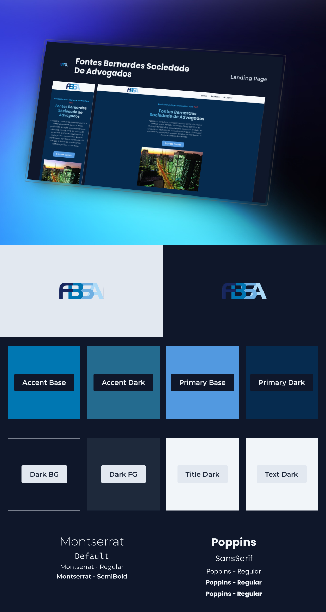

# [`⚖️ FBSA`](https://fbsa.com.br) <!-- omit in toc -->

⚖️ Site desenvolvido para a Fontes Bernardes Sociedade de Advogados.

## 📖 `Sumário` <!-- omit in toc -->

- [🏷️ `Recursos`](#️-recursos)
- [📜 `Propósito`](#-propósito)
- [👨‍💻 `Tecnologia E Pacotes`](#-tecnologia-e-pacotes)

### 🏷️ `Recursos`

- Utilizado Qwik para maior performance possível. Muitos indicadores mostram correlação entre taxa de conversão e retenção com a performance de um site.

### 📜 `Propósito`

Apresentar todos os serviços oferecidos pela instituição de maneira concisa e centralizada.

### 👨‍💻 `Tecnologia E Pacotes`

 
   
   
   
   

 

[⬆ De Volta Ao Topo](#-fbsa)
